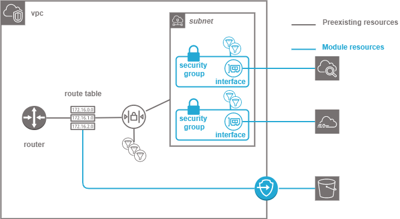

.. image:: docs/imgs/logo.png
   :alt: Logo

=====================================
AWS service endpoint terraform module
=====================================

About The Project
=================

This project contains all the infrastructure as code (IaC) to deploy a secured service endpoint in an AWS VPC.
A service endpoint enables private communication with AWS managed services from an internal VPC using privatelink

.. image:: https://badgen.net/github/checks/nadegelemperiere-aws/module-aws-service-endpoint
   :target: https://github.com/nadegelemperiere-aws/module-aws-service-endpoint/actions/workflows/release.yml
   :alt: Status
.. image:: https://img.shields.io/static/v1?label=license&message=MIT&color=informational
   :target: ./LICENSE
   :alt: License
.. image:: https://badgen.net/github/commits/nadegelemperiere-aws/module-aws-service-endpoint/main
   :target: https://github.com/nadegelemperiere-aws/robotframework
   :alt: Commits
.. image:: https://badgen.net/github/last-commit/nadegelemperiere-aws/module-aws-service-endpoint/main
   :target: https://github.com/nadegelemperiere-aws/robotframework
   :alt: Last commit

Built With
----------

.. image:: https://img.shields.io/static/v1?label=terraform&message=1.6.4&color=informational
   :target: https://www.terraform.io/docs/index.html
   :alt: Terraform
.. image:: https://img.shields.io/static/v1?label=terraform%20AWS%20provider&message=5.26.0&color=informational
   :target: https://registry.terraform.io/providers/hashicorp/aws/latest/docs
   :alt: Terraform AWS provider

Getting Started
===============

Prerequisites
-------------

A virtual private cloud structure shall exist in order to integrate the endpoint into a wider network.

A subnet dedicated to interfaces shall exist to integrate interface endpoints

In order to create the endpoint, some information are required :

* The type of endpoint and the service it provides access to

* The vpc in which the endpoint shall be deployed

* The vpc route table to associate with the endpoint for gateway endpoint.

* The accesses that are permitted for interfaces endpoint

Configuration
-------------

To use this module in a wider terraform deployment, add the module to a terraform deployment using the following module:

.. code:: terraform

    module "group" {

        source            = "git::https://github.com/nadegelemperiere-aws/module-aws-service-endpoint?ref=<this module version"
        project           = the project to which the permission set belongs to be used in naming and tags
        module            = the project module to which the permission set belongs to be used in naming and tags
        email             = the email of the person responsible for the permission set maintainance
        environment       = the type of environment to which the permission set contributes (prod, preprod, staging, sandbox, ...) to be used in naming and tags
        git_version       = the version of the deployment that uses the permission sets to be used as tag
        account           = AWS account to allow access to root user by default
        service_principal = technical IAM account used for automation that shall be able to access the endpoint
        type              = Type of the service to create : gateway or interface
        service           = Name of the service to create
        vpc               = {
            id       = the aws id of the virtual private cloud in which the endpoint shall be deployed
            route    = the aws id of the vpc route table to associate with the endpoint
        }
        subnet            = the id of the  in which the interfaces shall be deployed
        links             = [ list of the flows to allow access to the endpoint
            {
                service    = type of the service to interface in vpc
                protocol   = protocol of the flow
                port       = port used by the flow
                prefixes	= list of the prefixes to which the service needs to have access to
            }
        ]
        rights            = [ List of rules describing allowed endpoint access
           {
                description = Name of the set of rules, type AllowSomebodyToDoSomething
                actions     = [ List of allowed s3 actions, like "s3:PutObject" for example, depending on the endpoint associated service ]
                principal   = {
                    aws            = [ list of roles and/or iam users that are allowed endpoint access ]
                    services       = [ List of AWS services that are allowed endpoint access ]
                }
            }
        ]
    }

Usage
-----

The module is deployed alongside the module other terraform components, using the classic command lines :

.. code:: bash

    terraform init ...
    terraform plan ...
    terraform apply ...

Detailed design
===============

Module creates a service endpoint, gateway or interface depending on the module configuration.

If the service endpoint is a gateway, it is associated to the vpc route table, to enable access to the endpoint from inside the vpc.

If it is an interface, it is linked to some VPC subnets that will give it a local IP in the VPC.
It can be linked to more than one subnets, in case high availability requires replication of the VPC subnet on several availability zone.
Interfaces are also given a security group to fine tune the access to the interface from the local subnet.

.. important::
   Security groups are stateful, meaning you shall only build rule to allow :

   - The ingress requests from any location access to the endpoint. The response will automatically be allowed through security group

   - The egress requests from the endpoint to required locations. The response will automatically be allowed through security group

Testing
=======

Tested With
-----------

.. image:: https://img.shields.io/static/v1?label=aws_iac_keywords&message=v1.5.0&color=informational
   :target: https://github.com/nadegelemperiere-aws/robotframework
   :alt: AWS iac keywords
.. image:: https://img.shields.io/static/v1?label=python&message=3.12&color=informational
   :target: https://www.python.org
   :alt: Python
.. image:: https://img.shields.io/static/v1?label=robotframework&message=6.1.1&color=informational
   :target: http://robotframework.org/
   :alt: Robotframework
.. image:: https://img.shields.io/static/v1?label=boto3&message=1.29.3&color=informational
   :target: https://boto3.amazonaws.com/v1/documentation/api/latest/index.html
   :alt: Boto3

Environment
-----------

Tests can be executed in an environment :

* in which python and terraform has been installed, by executing the script `scripts/robot.sh`_, or

* in which docker is available, by using the `aws infrastructure image`_ in its latest version, which already contains python and terraform, by executing the script `scripts/test.sh`_

.. _`aws infrastructure image`: https://github.com/nadegelemperiere-docker/terraform-python-awscli
.. _`scripts/robot.sh`: scripts/robot.sh
.. _`scripts/test.sh`: scripts/test.sh

Strategy
--------

The test strategy consists in terraforming test infrastructures based on the endpoint module and check that the resulting AWS infrastructure matches what is expected.
The tests currently contains 1 test :

1 - A test to check the capability to create multiple endpoints based on the module and the terraform *count* keyword

The tests cases :

* Apply terraform to deploy the test infrastructure

* Use specific keywords to model the expected infrastructure in the boto3 format.

* Use shared EC2 keywords built from boto3 to check that the boto3 input matches the expected infrastructure

NB : It is not possible to completely specify the expected infrastructure, since some of the value returned by boto are not known before apply. The comparaison functions checks that all the specified data keys are present in the output, leaving alone the other undefined keys.

Results
-------

The test results for latest release are here_

.. _here: https://nadegelemperiere-aws.github.io/module-aws-service-endpoint/report.html

Issues
======

.. image:: https://img.shields.io/github/issues/nadegelemperiere-aws/module-aws-service-endpoint.svg
   :target: https://github.com/nadegelemperiere-aws/module-aws-service-endpoint/issues
   :alt: Open issues
.. image:: https://img.shields.io/github/issues-closed/nadegelemperiere-aws/module-aws-service-endpoint.svg
   :target: https://github.com/nadegelemperiere-aws/module-aws-service-endpoint/issues
   :alt: Closed issues

Roadmap
=======

N.A.

Contributing
============

.. image:: https://contrib.rocks/image?repo=nadegelemperiere-aws/module-aws-service-endpoint
   :alt: GitHub Contributors Image

We welcome contributions, do not hesitate to contact us if you want to contribute.

License
=======

This code is under MIT License.

Contact
=======

Nadege LEMPERIERE - nadege.lemperiere@gmail.com

Acknowledgments
===============

N.A.
